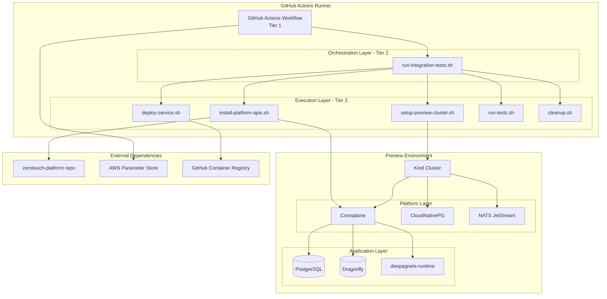
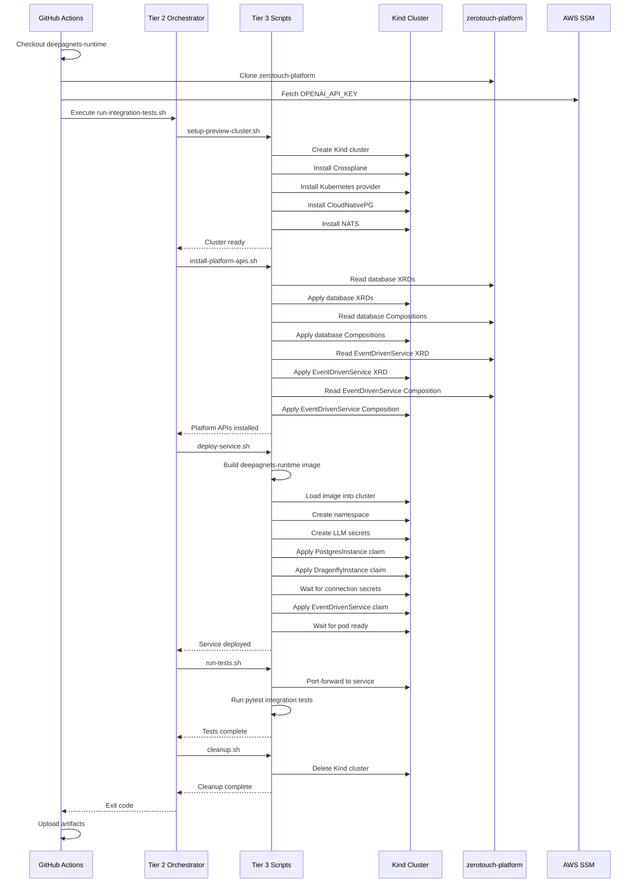

# Design Document

## Overview

This design document outlines the architecture and implementation approach for a GitHub Actions CI workflow that validates deepagnets-runtime integration with zerotouch-platform APIs. The workflow creates a preview Kubernetes environment using Kind, installs platform components from zerotouch-platform, applies existing claims from deepagnets-runtime, and runs integration tests to detect breaking changes in platform APIs.

The design follows the Script Hierarchy Model with three tiers: GitHub Actions workflow (Tier 1), orchestration scripts (Tier 2), and execution scripts (Tier 3). The workflow uses the External Observer Pattern, consuming existing manifests without creating test-specific configurations.

## Architecture

### High-Level Architecture



### Workflow Execution Flow



## Components and Interfaces

### Tier 1: GitHub Actions Workflow

**File:** `.github/workflows/deepagnets-integration-tests.yml`

**Responsibilities:**
- Define trigger conditions (push, pull_request, workflow_dispatch)
- Configure AWS OIDC authentication
- Fetch secrets from AWS Parameter Store
- Set up Python environment
- Execute Tier 2 orchestration script
- Upload test artifacts
- Post PR comments with test results

**Key Configuration:**
```yaml
on:
  push:
    branches: [main]
    paths:
      - '**/*.py'
      - 'Dockerfile'
      - 'pyproject.toml'
      - 'platform/claims/**'
      - '.github/workflows/deepagnets-integration-tests.yml'
  pull_request:
    branches: [main]
  workflow_dispatch:
    inputs:
      platform_branch:
        description: 'zerotouch-platform branch'
        default: 'main'

permissions:
  id-token: write
  contents: read
  pull-requests: write

timeout-minutes: 45
```

### Tier 2: Orchestration Script

**File:** `scripts/ci/run-integration-tests.sh`

**Responsibilities:**
- Validate environment variables
- Clone zerotouch-platform repository
- Coordinate execution of Tier 3 scripts
- Handle errors and cleanup
- Aggregate exit codes

**Interface:**
```bash
#!/bin/bash
# Environment Variables (required):
#   OPENAI_API_KEY - LLM API key from AWS SSM
#   PLATFORM_BRANCH - zerotouch-platform branch (default: main)
#
# Exit Codes:
#   0 - Success
#   1 - Setup failure
#   2 - Platform installation failure
#   3 - Deployment failure
#   4 - Test failure
```

### Tier 3: Execution Scripts

#### setup-preview-cluster.sh

**Responsibilities:**
- Create Kind cluster with appropriate configuration
- Install Crossplane via Helm
- Install Crossplane Kubernetes provider
- Install CloudNativePG operator
- Install ESO by applying platform's ArgoCD Application manifest (kubectl apply -f zerotouch-platform/bootstrap/components/01-eso.yaml)
- Wait for ESO deployment to be ready
- Inject AWS credentials using platform's script (zerotouch-platform/scripts/bootstrap/07-inject-eso-secrets.sh)
- Apply platform's ClusterSecretStore (from zerotouch-platform/platform/01-foundation/aws-secret-store.yaml)
- Install NATS with JetStream
- Create NATS streams
- Wait for all components to be ready

**Interface:**
```bash
#!/bin/bash
# Creates and configures Kind cluster with platform dependencies
#
# Exit Codes:
#   0 - Success
#   1 - Kind cluster creation failed
#   2 - Crossplane installation failed
#   3 - Provider installation failed
#   4 - CNPG installation failed
#   5 - NATS installation failed
```

#### install-platform-apis.sh

**Responsibilities:**
- Apply database XRDs from zerotouch-platform
- Apply database Compositions from zerotouch-platform
- Apply EventDrivenService XRD from zerotouch-platform
- Apply EventDrivenService Composition from zerotouch-platform
- Wait for CRDs to be established
- Validate XRDs are registered

**Interface:**
```bash
#!/bin/bash
# Installs platform APIs from zerotouch-platform repository
#
# Arguments:
#   $1 - Path to zerotouch-platform repository
#
# Exit Codes:
#   0 - Success
#   1 - XRD application failed
#   2 - Composition application failed
#   3 - CRD not established
```

#### deploy-service.sh

**Responsibilities:**
- Build deepagnets-runtime Docker image
- Load image into Kind cluster
- Create intelligence-deepagents namespace
- Apply ExternalSecret manifests from deepagnets-runtime
- Wait for ExternalSecrets to sync and create Kubernetes secrets
- Apply claims in sync-wave order
- Wait for database connection secrets
- Wait for agent-executor pod to be ready
- Verify all expected resources exist

**Interface:**
```bash
#!/bin/bash
# Deploys deepagnets-runtime using platform claims
#
# Environment Variables:
#   OPENAI_API_KEY - LLM API key
#
# Exit Codes:
#   0 - Success
#   1 - Image build failed
#   2 - Claim application failed
#   3 - Resource creation failed
#   4 - Pod not ready
```

#### run-tests.sh

**Responsibilities:**
- Set up port forwarding to services
- Configure test environment variables
- Execute pytest integration tests
- Generate coverage reports
- Save test results in JUnit XML format

**Interface:**
```bash
#!/bin/bash
# Runs integration tests against deployed service
#
# Exit Codes:
#   0 - All tests passed
#   1 - Tests failed
#   2 - Test execution error
```

#### cleanup.sh

**Responsibilities:**
- Save debugging artifacts
- Delete Kind cluster
- Clean up Docker resources
- Remove temporary files

**Interface:**
```bash
#!/bin/bash
# Cleans up preview environment
#
# Exit Codes:
#   0 - Success (always succeeds)
```

## Data Models

### Kind Cluster Configuration

```yaml
kind: Cluster
apiVersion: kind.x-k8s.io/v1alpha4
name: deepagnets-preview
nodes:
  - role: control-plane
    extraPortMappings:
      - containerPort: 30080  # NATS client port
        hostPort: 4222
      - containerPort: 30432  # PostgreSQL port
        hostPort: 5432
      - containerPort: 30379  # Dragonfly port
        hostPort: 6379
```

### Environment Variables

```bash
# CI-provided
OPENAI_API_KEY          # From AWS Parameter Store
PLATFORM_BRANCH         # zerotouch-platform branch (default: main)
AWS_ROLE_ARN           # For OIDC authentication

# Script-generated
KUBECONFIG             # Path to Kind kubeconfig
ZEROTOUCH_PLATFORM_DIR # Path to cloned zerotouch-platform
ARTIFACTS_DIR          # Path to artifacts directory
```

### Artifact Structure

```
artifacts/
├── pods.txt                    # Pod status from all namespaces
├── keda-scaledobjects.txt     # KEDA ScaledObject descriptions
├── crossplane-claims.txt      # Crossplane claim status
├── agent-executor-logs.txt    # Pod logs
├── test-results.xml           # JUnit XML test results
├── coverage.xml               # Coverage report (XML)
└── htmlcov/                   # Coverage report (HTML)
```

## Correctness Properties

*A property is a characteristic or behavior that should hold true across all valid executions of a system-essentially, a formal statement about what the system should do. Properties serve as the bridge between human-readable specifications and machine-verifiable correctness guarantees.*

### Property 1: Idempotent script execution

*For any* script in the Tier 3 execution layer, running the script multiple times should produce the same result without errors
**Validates: Requirements 16.1, 16.2, 16.3, 16.4**

### Property 2: Resource readiness before proceeding

*For any* Kubernetes resource that has a readiness condition, the system should wait for the condition to be met before proceeding to dependent steps
**Validates: Requirements 17.1, 17.2, 17.3, 17.4**

### Property 3: Breaking change detection

*For any* incompatible change in zerotouch-platform XRDs or Compositions, the workflow should fail when applying deepagnets-runtime claims
**Validates: Requirements 12.1, 12.2, 12.3, 12.4, 12.5**

### Property 4: Artifact preservation on failure

*For any* workflow execution that fails, all debugging artifacts should be saved and uploaded
**Validates: Requirements 18.1, 18.2, 18.3, 18.4, 18.5**

### Property 5: External Observer Pattern compliance

*For any* claim applied in the preview environment, the claim must come from deepagnets-runtime/platform/claims directory without modification
**Validates: Requirements 4.2, 4.3**

### Property 6: Platform API consumption

*For any* platform component installed, the XRD and Composition must come from zerotouch-platform repository
**Validates: Requirements 2.2, 2.3, 2.4, 2.5**

### Property 7: Timeout enforcement

*For any* wait operation, if the timeout is exceeded, the system should fail with a clear error message
**Validates: Requirements 17.5**

### Property 8: Sync-wave ordering

*For any* set of claims with sync-wave annotations, claims with lower wave numbers must be applied and ready before claims with higher wave numbers
**Validates: Requirements 4.3**

## Error Handling

### Error Categories

1. **Setup Errors** - Kind cluster creation, Crossplane installation
   - Action: Fail fast, cleanup, exit with code 1
   - Artifacts: Kind logs, Helm output

2. **Platform API Errors** - XRD/Composition application failures
   - Action: Fail fast, save CRD status, cleanup, exit with code 2
   - Artifacts: CRD status, kubectl describe output

3. **Deployment Errors** - Claim application, resource creation failures
   - Action: Save claim status, pod logs, cleanup, exit with code 3
   - Artifacts: Claim status, pod logs, events

4. **Test Errors** - Integration test failures
   - Action: Save test results, cleanup, exit with code 4
   - Artifacts: Test results, coverage reports, pod logs

### Retry Strategy

```bash
# Wait with timeout pattern
kubectl wait <resource> \
  --for=condition=<condition> \
  --timeout=<timeout>s \
  || { echo "ERROR: Resource not ready"; exit 1; }

# Idempotent create pattern
kubectl get ns "$NS" >/dev/null 2>&1 || kubectl create ns "$NS"

# Helm install with check
helm list -n "$NS" | grep -q "$RELEASE" || \
  helm install "$RELEASE" "$CHART" -n "$NS"
```

## Testing Strategy

### Unit Testing

Not applicable - this is infrastructure automation code. Validation happens through:
- Shellcheck for bash scripts
- YAML validation for manifests
- Dry-run testing locally

### Integration Testing

The workflow itself IS the integration test. It validates:
- Platform API compatibility
- Claim validity
- Resource provisioning
- Service deployment
- End-to-end functionality

### Validation Approach

1. **Pre-flight Checks**
   - Validate environment variables
   - Check tool availability (kubectl, helm, kind, docker)
   - Validate zerotouch-platform clone

2. **Progressive Validation**
   - After each major step, verify expected state
   - Use `kubectl wait` for readiness
   - Check resource existence before proceeding

3. **Post-deployment Validation**
   - Verify all Crossplane resources created
   - Check pod logs for errors
   - Validate connection secrets exist
   - Run pytest integration tests

## Security

### Secret Management

- **LLM API Keys**: Synced from AWS Parameter Store via ESO ExternalSecret manifests
- **Database Credentials**: Auto-generated by CNPG, stored in Kubernetes secrets
- **Image Pull Secrets**: Synced from AWS Parameter Store via ESO (for production), not needed in CI (image loaded into Kind)

### Cluster Isolation

- Kind cluster runs in isolated Docker network
- No external network access except for image pulls
- Cluster deleted after tests complete

### Least Privilege

- GitHub Actions uses OIDC with minimal IAM permissions
- Only read access to AWS Parameter Store
- No write access to production resources

## Deployment

### Prerequisites

- GitHub repository with Actions enabled
- AWS IAM role configured for OIDC
- AWS Parameter Store with OPENAI_API_KEY
- GitHub secret: AWS_ROLE_ARN

### Installation Steps

1. Create GitHub Actions workflow file
2. Create Tier 2 orchestration script
3. Create Tier 3 execution scripts
4. Configure AWS IAM role and trust policy
5. Add AWS_ROLE_ARN to GitHub secrets
6. Test workflow with manual trigger

### Rollout Strategy

1. **Phase 1**: Manual trigger only, validate on feature branch
2. **Phase 2**: Enable on pull requests, monitor for flakiness
3. **Phase 3**: Enable on main branch pushes
4. **Phase 4**: Add branch protection requiring tests to pass

## Performance Considerations

### Optimization Strategies

1. **Caching**
   - Cache Helm charts between runs
   - Cache Python dependencies
   - Cache Docker layers

2. **Parallel Execution**
   - Install platform components in parallel where possible
   - Run independent validation checks concurrently

3. **Fast Failure**
   - Validate claims before applying
   - Check prerequisites before starting expensive operations
   - Use kubectl wait with appropriate timeouts

### Expected Timings

```
Setup preview cluster:        5-8 minutes
Install platform APIs:        2-3 minutes
Deploy service:              3-5 minutes
Run integration tests:       5-10 minutes
Cleanup:                     1-2 minutes
Total:                       16-28 minutes
```

## Monitoring and Observability

### Workflow Metrics

- Execution time per step
- Success/failure rate
- Flakiness detection (retry counts)

### Debugging Artifacts

Saved to `artifacts/` directory:
- Pod status and descriptions
- KEDA ScaledObject status
- Crossplane claim status
- Pod logs
- Test results and coverage

### GitHub Actions Integration

- PR comments with test results
- Workflow summary with key metrics
- Artifact upload for debugging

## Future Enhancements

1. **Multi-version Testing**: Test against multiple zerotouch-platform versions
2. **Performance Benchmarking**: Track deployment time trends
3. **Chaos Testing**: Inject failures to test resilience
4. **Contract Testing**: Validate API contracts explicitly
5. **Notification Integration**: Slack alerts for failures

## References

- [Kind Documentation](https://kind.sigs.k8s.io/)
- [Crossplane Documentation](https://docs.crossplane.io/)
- [CloudNativePG Documentation](https://cloudnative-pg.io/)
- [KEDA Documentation](https://keda.sh/)
- [GitHub Actions Documentation](https://docs.github.com/en/actions)
- [Script Hierarchy Model](../../bizmatters/.claude/skills/standards/script-hierarchy-model.md)
